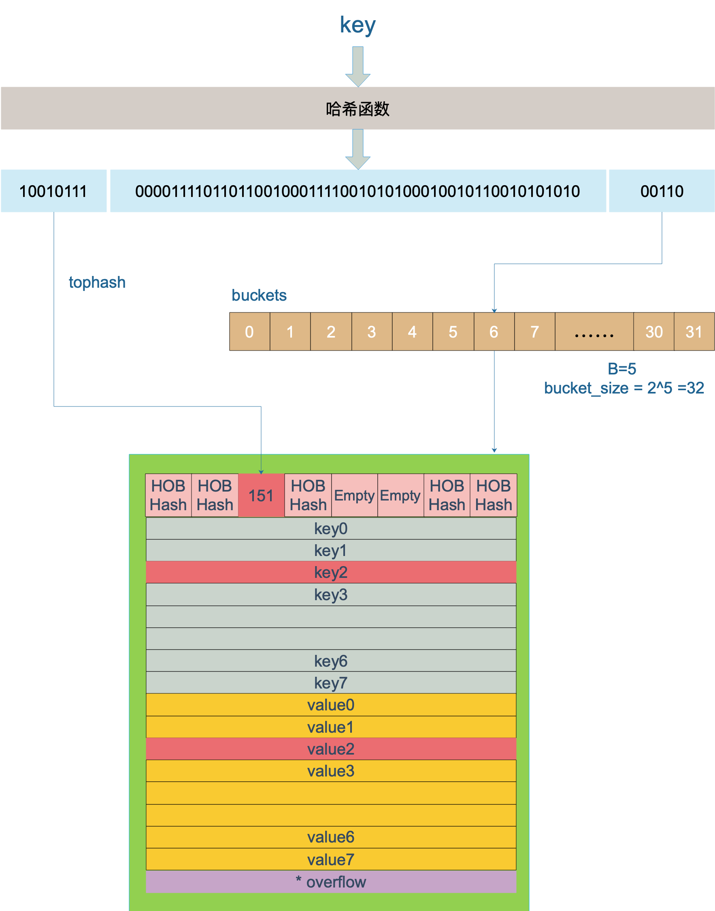

## array

在 Go 语言中我们通过如下方式声明数组类型：

```go
[5]int
[10]interface{}
```

数组类型包含数组长度以及元素类型，长度不同或者元素类型不同的数组是不同类型的

```go
var (
	a [2]int
	b [3]int
	c [2]interface{}
	d [3]interface{}
)
fmt.Printf("a type:%T,b type:%T,c type:%T,d type:%T\n", a, b, c, d)
// output
// a type:[2]int,b type:[3]int,c type:[2]interface {},d type:[3]interface {}
```

数组长度可以根据字面量进行推导,可以通过下面的方式初始化数组，编译时会自动推导数组长度

```go
e := [...]int{1, 2, 3}
fmt.Printf("%T\n", e)
// output
// [3]int
```

可以通过内置函数`len` 获取数组长度

```go
f := [8]int{}
fmt.Printf("len:%d,cap:%d\n", len(f), cap(f))
// output
// len:8,cap:8
```

## slice

切片是变长数组的实现方案，切片类型如下：

```go
var ss []int
fmt.Printf("%T\n", ss)
// output
// []int
```

运行时结构为：

```go
type slice struct {
	array unsafe.Pointer //指向底层数组的指针
	len   int
	cap   int
}
```

可通过内置函数 `len` 获取长度，`cap` 获取容量,`append`进行元素追加

### 初始化

#### 直接使用

未初始化的切片等于`nil`,可以直接使用。因为切片实际上是一个结构体，声明一个切片时，所有字段初始化为零值

```go
var ss []int
fmt.Printf("%p,%p,%d,%d,%t\n", &ss, ss, len(ss), cap(ss), ss == nil)
ss = append(ss, 1)
fmt.Printf("%p,%p,%d,%d\n", &ss, ss, len(ss), cap(ss))
// output
// 0xc0001346d8,0x0,0,0,true
// 0xc0001346d8,0xc00012a738,1,1
```

注意：当我们使用 `%p` 打印切片时，打印的实际上是底层数组的地址

#### 通过字面量初始化

```go
s:=[]int{1,2,3}
```

#### 通过 `make` 初始化切片

```go
s6 := make([]int, 2, 6)
fmt.Printf("%p,%d,%d\n", s6, len(s6), cap(s6))
// output
// 0xc00002c210,2,6
```

`make` 操作在编译时会根据切片大小、容量以及是否发生逃逸，来决定行为:

- 当切片足够小且没有发生逃逸时会直接分配数组，然后对数组进行切片操作获得切片

```go
var arr [4]int
s := arr[:]
```

- 否则转化为对`runtime.makeslice`调用在堆上分配

#### 下标操作

可以通过下标操作`s[a:b:c]`从已有数组或切片获取一个新的切片，新的切片共享底层数组,操作中 a 不指定默认为 0，b 不指定默认为 len(s),c 不指定默认为 cap(s),新生成的切片 len=b-a,cap=c-a

```go
a := [5]int{}
fmt.Printf("addr:%p,len:%d,cap:%d\n", &a, len(a), cap(a))
s1 := a[:]
fmt.Printf("addr:%p,len:%d,cap:%d\n", s1, len(s1), cap(s1))
s2 := s1[1:]
fmt.Printf("addr:%p,len:%d,cap:%d\n", s2, len(s2), cap(s2))
s3 := s1[1:2]
fmt.Printf("addr:%p,len:%d,cap:%d\n", s3, len(s3), cap(s3))
s4 := s1[1:2:3]
fmt.Printf("addr:%p,len:%d,cap:%d\n", s4, len(s4), cap(s4))
// output
//addr:0xc00002c240,len:5,cap:5
//addr:0xc00002c240,len:5,cap:5
//addr:0xc00002c248,len:4,cap:4
//addr:0xc00002c248,len:1,cap:4
//addr:0xc00002c248,len:1,cap:2
```

### 扩容

当通过`append`操作追加元素时，元素数量超过切片的容量时，切片会发生扩容。
扩容操作本质上是开辟一个新的容量足够大的数组，将原来的数组元素复制到新数组，将切片的数组指针指向新数组，新数组的容量选取需要考虑两方面的因素：

- 扩容操作会涉及到内存拷贝，是一个比较耗时的操作，所以需要尽可能减少扩容发生的概率
- 尽量避免内存浪费，新分配的内存尽可能多的使用，原有的内存能够有效的回收

基于以上考虑，运行时根据切片的当期容量选择不同扩容策略：

- 如果期望容量大于当前容量的两倍就会使用期望容量；
- 如果当前切片的长度小于 1024 就会将容量翻倍；
- 如果当前切片的长度大于 1024 就会每次增加 25% 的容量，直到新容量大于期望容量；

## string

运行时结构如下

```go
type stringStruct struct {
	str unsafe.Pointer //指向[]byte的指针
	len int
}
```

### 字符串的字面量形式

- 双引号
- 反引号

```go
s:="hello world"
s1:=`a
b
`
```

### 字符串类型转化

- `string` 和 `[]byte`
  标准类型转换

```go
a:="hello world"
b:=[]byte(a)
c:=string(b)
```

实际上调用了`runtime.stringtoslicebyte` 和`runtime.slicebytetostring`函数
会进行内存拷贝

可以通过指针类型转换来避免内存拷贝

```go
// string to slice no copy
a:="abcde"
s := *(*reflect.SliceHeader)(unsafe.Pointer(&a))
s.Cap=len(a)
d:=*(*[]byte)(unsafe.Pointer(&s))
// slice to string no copy
b := []byte("abcde")
e := *(*string)(unsafe.Pointer(&b))
```

注意：通过指针将一个`string`转为`slice`后应该避免修改，否则会报异常，因为`string` 字面量是只读的

```go
d[0] = 'j'
// ouput
// unexpected fault address 0x15cfe93
// fatal error: fault
```

- `string` 和 `[]rune`
  标准类型转换

```go
aa := "hello world"
bb := []rune(aa)
cc := string(bb)
```

底层会调用`runtime.stringtoslicerune` 和 `runtime.slicerunetostring` 函数

### 字符串的拼接

- 通过`+`进行拼接

```go
a:= "hello"
b:="world"
c:=a+" "+b
```

编译器会转化为对`runtime.concatstrings`函数的调用：

```go
// concatstrings implements a Go string concatenation x+y+z+...
// The operands are passed in the slice a.
// If buf != nil, the compiler has determined that the result does not
// escape the calling function, so the string data can be stored in buf
// if small enough.
func concatstrings(buf *tmpBuf, a []string) string {
	idx := 0
	l := 0
	count := 0
	for i, x := range a {
		n := len(x)
		if n == 0 {
			continue
		}
		if l+n < l {
			throw("string concatenation too long")
		}
		l += n
		count++
		idx = i
	}
	if count == 0 {
		return ""
	}

	// If there is just one string and either it is not on the stack
	// or our result does not escape the calling frame (buf != nil),
	// then we can return that string directly.
	if count == 1 && (buf != nil || !stringDataOnStack(a[idx])) {
		return a[idx]
	}
	s, b := rawstringtmp(buf, l)
	for _, x := range a {
		copy(b, x)
		b = b[len(x):]
	}
	return s
}
```

该函数会计算出最终字符串的长度，一次分配内存空间给目标串，再把待拼接字符串依次拷贝到目标串

- 通过`strings.Builder` 高效构建字符串

```go
sb := strings.Builder{}
sb.Grow(11)
sb.WriteString("hello")
sb.WriteByte(' ')
sb.WriteString("world")
fmt.Println(sb.String())
// output
// hello world
```

`strings.Builder` 用一个字节切片作为容器

```go
type Builder struct {
	addr *Builder // of receiver, to detect copies by value
	buf  []byte
}
```

通过提前预估容量，调用`Grow`函数，可以有效的减少内存分配次数

```go

func (b *Builder) grow(n int) {
	buf := make([]byte, len(b.buf), 2*cap(b.buf)+n)
	copy(buf, b.buf)
	b.buf = buf
}

func (b *Builder) Grow(n int) {
	b.copyCheck()
	if n < 0 {
		panic("strings.Builder.Grow: negative count")
	}
	if cap(b.buf)-len(b.buf) < n {
		b.grow(n)
	}
}
```

`String`函数通过指针强制转换避免了从字节切片到字符串的内存拷贝

```go
// String returns the accumulated string.
func (b *Builder) String() string {
	return *(*string)(unsafe.Pointer(&b.buf))
}
```

## map

Go 语言中的 map 实现为 hash 表，运行时结构为：

```go
// A header for a Go map.
type hmap struct {
	// Note: the format of the hmap is also encoded in cmd/compile/internal/gc/reflect.go.
	// Make sure this stays in sync with the compiler's definition.
	count     int // # live cells == size of map.  Must be first (used by len() builtin)
	flags     uint8
	B         uint8  // log_2 of # of buckets (can hold up to loadFactor * 2^B items)
	noverflow uint16 // approximate number of overflow buckets; see incrnoverflow for details
	hash0     uint32 // hash seed

	buckets    unsafe.Pointer // array of 2^B Buckets. may be nil if count==0.
	oldbuckets unsafe.Pointer // previous bucket array of half the size, non-nil only when growing
	nevacuate  uintptr        // progress counter for evacuation (buckets less than this have been evacuated)

	extra *mapextra // optional fields
}
```

可用 `len` 获取 map 的长度

map 中实际存储键值对的容器是`bucket`(桶)，运行时结构为`bmap`,一个 bucket 可以存放 8 个键值对

```go
type bmap struct {
    topbits  [8]uint8
    keys     [8]keytype
    values   [8]valuetype
    pad      uintptr
    overflow uintptr
}
```

map 的内存结构如下图：


### 初始化

未初始化的 map 等于`nil`,对其进行写操作会报异常,我们申明的 map 类型变量实际上是 `*hmap` 类型的。

```go
var m1 map[string]int
fmt.Printf("%p,len:%d,size:%v,is nil:%t\n", m1, len(m1), unsafe.Sizeof(m1), m1 == nil)
// output
// 0x0,len:0,size:8,is nil:true
fmt.Println(m1["a"])
// output
// 0
m1["a"]=1
// output
// panic: assignment to entry in nil map
```

#### 字面量初始化

```go
m:=map[int]string{1:"abc",2:"cbe"}
```

#### `make`初始化

可以指定初始容量

```go
m1:=make(map[int]string)
m2:=make(map[int]string,2)
```

无论是字面量还是`make`函数，都会被 Go 语言编译器在类型检查期间转化为`runtime.makemap` 调用

```go
func makemap(t *maptype, hint int, h *hmap) *hmap {
	mem, overflow := math.MulUintptr(uintptr(hint), t.bucket.size)
	if overflow || mem > maxAlloc {
		hint = 0
	}

	// initialize Hmap
	if h == nil {
		h = new(hmap)
	}
	h.hash0 = fastrand()

	// Find the size parameter B which will hold the requested # of elements.
	// For hint < 0 overLoadFactor returns false since hint < bucketCnt.
	B := uint8(0)
	for overLoadFactor(hint, B) {
		B++
	}
	h.B = B

	// allocate initial hash table
	// if B == 0, the buckets field is allocated lazily later (in mapassign)
	// If hint is large zeroing this memory could take a while.
	if h.B != 0 {
		var nextOverflow *bmap
		h.buckets, nextOverflow = makeBucketArray(t, h.B, nil)
		if nextOverflow != nil {
			h.extra = new(mapextra)
			h.extra.nextOverflow = nextOverflow
		}
	}

	return h
}

```

总结一下，初始化过程包括：

- 创建 hmap 变量
- 初始化 hmap 中的字段（主要是 bucket 数组）

### 访问


- 直接访问,如果 key 不存在则返回元素零值

```go
m:=map[int]string{1:"dog",2:"cat"}
fmt.Println(m[1])
```

- comma_ok 形式，ok 字段表示 key 是否存在

```go
m:=map[int]string{1:"dog",2:"cat"}
v,ok:=m[2]
```

这两种访问对应运行时函数`runtime.mapaccess1` 和`runtime.mapaccess2` 函数。

key的查找过程如下图：



+ 计算key的hash
+ 根据hash的低B位在bucket数组中找到bucket
+ 根据hash的高8位与bucket中的tophash数组进行比对，找到key的位置

### 遍历

可以通过 `range` 关键字遍历 map,注意遍历的顺序是随机的

```go
m2 := map[int]string{
	1: "cat",
	2: "dog",
}
for k, v := range m2 {
	fmt.Println(k, v)
}
// output
// 1 cat
// 2 dog
```

编译器会重写`for-range`循环，将其换为对运行时函数`runntime.mapiterinit`和`runtime.mapiternext`的调用

```go
ha := a
hit := hiter(n.Type)
th := hit.Type
mapiterinit(typename(t), ha, &hit)
for ; hit.key != nil; mapiternext(&hit) {
    key := *hit.key
    val := *hit.val
}
```
遍历的过程就是遍历每个bucket及其overflow bucket的过程，由于扩容的存在，会涉及到遍历新老bucket的问题。
遍历过程：
+ 创建一个迭代器并初始化（主要是确定初始bucket和初始cell）
+ 不断地获取下一个bucket进行遍历，直到回到起始bucket

此过程的难点在于2 倍扩容时，老 bucket 会分裂到 2 个新 bucket 中去。而遍历操作，会按照新 bucket 的序号顺序进行，碰到老 bucket 未搬迁的情况时，要在老 bucket 中找到将来要搬迁到新 bucket 来的 key。

### 写入

可以通过下标的方式进行写入

```go
m:=map[int]string{1:"abc",2:"cbe"}
m[1]="ccc"
m[3]="ddd"
```

编译器会将其转换为对运行时函数`runtime.mapassign`的调用，写入分为更新和新增，无论哪种都得先查找 key 所在的位置，查找的过程同访问的过程，如果查找到 key,则对其 value 进行更新，否则新增 kv。新增 kv 会进行扩容检查，如果满足条件，会进行扩容。

### 删除

可通过内置函数 `delete` 删除数组元素

```go
m:=map[int]string{1:"aaa"}
delete(m,1)
```

运行时实际调用的函数为`runtime.mapdelete`

删除的过程:
+ 判断flags标记，如果有写标记，则直接报异常"concurrent map writes"
+ 根据key的hash找到bucket，如果map处于扩容中，则触发一次搬迁操作
+ 找到key和value并清空，并设置对应tophash为emptyOne
+ 将count减一

### 扩容

底层容器为数组，所以会涉及到扩容。扩容操作会涉及所有 bucket 的迁移，这是一个比较耗时的过程，所以扩容实现为渐进式扩容，当扩容开始后，每次对 map 的写操作会搬迁 1~2 个 bucket。

+ 当负载因子超过6.5时会发生翻倍扩容
+ 当溢出桶的数量过多时会发生等量扩容


## 参考

- [Go 语言设计与实现](https://draveness.me/golang/)
- [Go 程序员面试宝典](https://golang.design/go-questions/)
